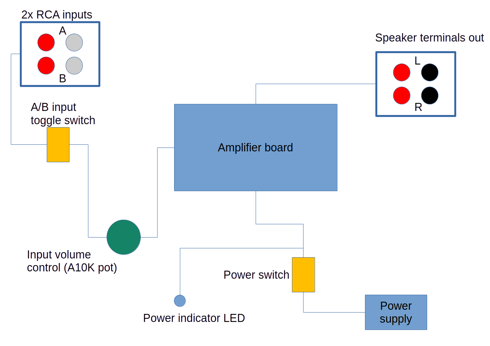
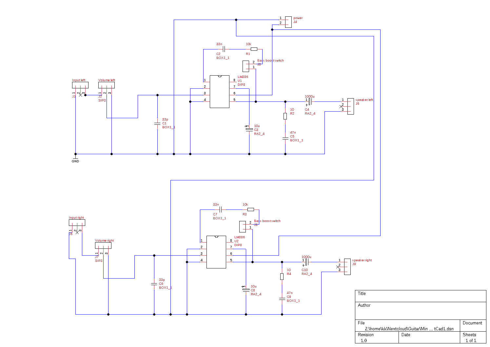
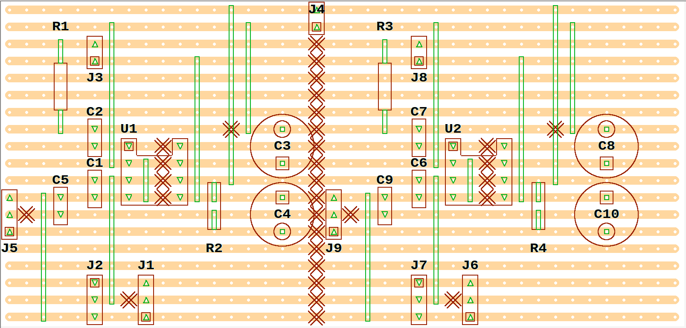

# Mini Stereo Amplifier
This is a very simple 2x1 watt stereo amplifier, based on the LM386 IC.

## Features
* stereo line-in input
* switchable bass boost
* input volume control

## Power supply
I use a regulated 12V DC power supply. The circuit below does not have any filtering on the power input! Please, add your own. Two caps, e.g., 100uF and 100nF should be good enough.

## Input switching, etc
The amplifier has only one input. So, if multiple inputs are required some switching must be implemented.
I actually use two sets of RCA sockets and connect them via a toggle switch to the amplifier. This way, I can comfortably switch between two inputs. Lately, I added another switch in between to switch to audio passthrough from a bluetooth module.

With my speakers, I quickly figured out that I don't need the bass boost. So, I simply implemented the option to swith it on with a jumper on the circuit board. Maybe in the future it will be of use to me.

## Other hardware
To complete the project, you will need some additional hardware

* RCA sockets for the audio input
* a stereo potentiometer (A10K) for the volume control
* speaker terminals to connect, wait for it, speakers
* a power LED is nice to have
* I also use a power switch to be able to switch it off without pulling the plug
* and of course a nice case

### Example links for hardware

* [A10K stereo potentiometer](https://www.audiophonics.fr/en/potentiometres-potentiometre-logarithmique/stereo-potentiometer-vra-100s10-10k-ohm-p-2385.html)
* [Speaker terminals](https://www.audiophonics.fr/en/binding-posts/dynavox-clamp-terminals-plated-gold-12mm-4-p-7946.html)
* [RCA sockets](https://www.audiophonics.fr/en/rca-sockets/elecaudio-er-109-rca-inlet-gold-plated-red-unit-p-12354.html)
* [Power supply](https://www.audiophonics.fr/en/power-supply/ac-adapter-100-240v-to-12v-3a-dc-p-11826.html)

## My simple setup
The following very simple illustration shows how I use the amplifier board. It's configured with dual switchable inputs, a volume control, a power switch and indicator LED.

## Files

* TinyCAD files are in the TinyCAD directory.
* VeeCAD files are in the VeeCAD directory.
* LTspice files are in the LTSpice directory.
* The inspiration directory contains circuits that I found on the internet

## Schematic
The schematic is drawn by TinyCAD.

## Strip board layout
I used VeeCAD to create a stripboard layout.

